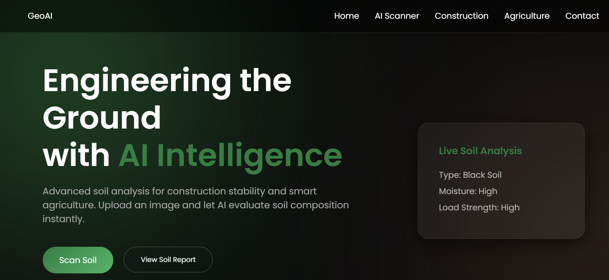
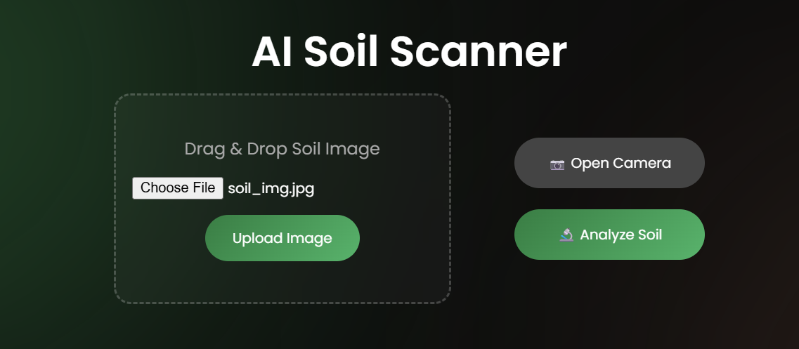
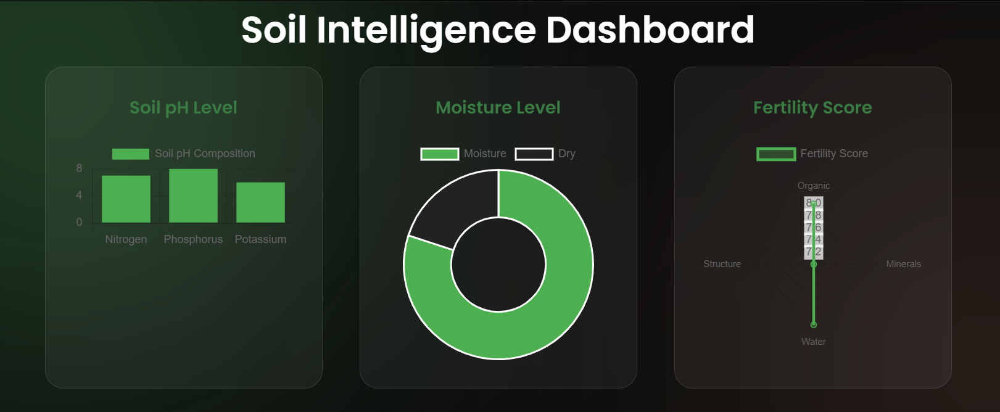
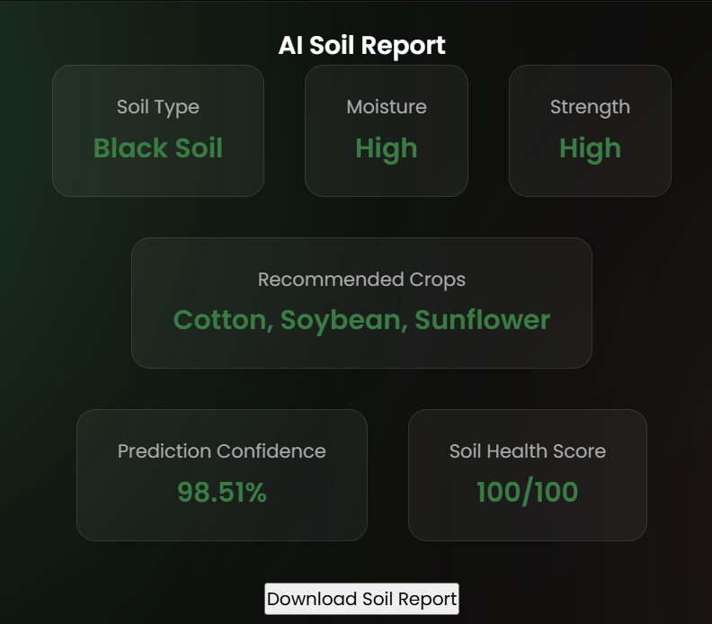
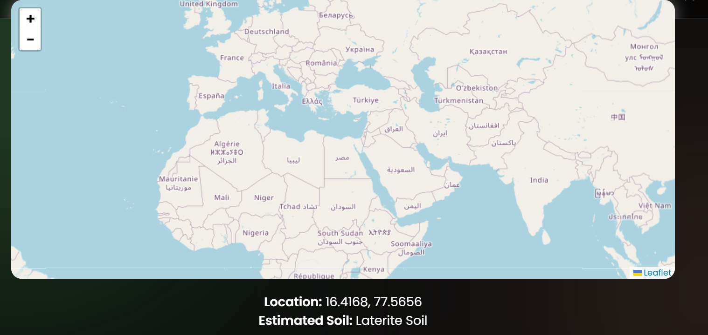

# 🌍 GeoAI Soil Intelligence Platform

<p align="center">
  
</p>

<p align="center">
  <b>AI-powered Soil Analysis using Deep Learning</b><br>
  Detect soil type, predict health, and get smart agriculture & construction insights.
</p>

---

## 🚀 Features

- 🧠 AI Soil Classification (Deep Learning)
- 💧 Soil Moisture Prediction
- 🏗 Soil Strength Analysis
- 🌱 Crop Recommendation System
- 📊 Soil Health Score
- 🎯 AI Confidence Score
- 📈 Interactive Dashboard (Chart.js)
- 📸 Camera-based Soil Scanning
- 🗂 Scan History (SQLite Database)
- 📄 Downloadable Soil Report

---

## 📊 Model Performance

- **Total Images Evaluated**: 1,189
- **Correct Predictions**: 1,160
- **Overall Accuracy**: **97.56%**

---

## 🧠 How It Works

1. Upload a soil image  
2. FastAPI backend processes the image  
3. Deep learning model predicts soil type  
4. System generates insights:
   - Soil Type  
   - Moisture Level  
   - Soil Strength  
   - Crop Recommendation  
   - Confidence Score  
   - Soil Health Score  
5. Results displayed on dashboard  
6. Stored in SQLite database  

---

## 🖼️ UI Preview

### 🏠 Home Page
<p align="center">
  
</p>

### 📸 AI Soil Scanner
<p align="center">
  
</p>

### 📊 Soil Analysis Dashboard
<p align="center">
  
</p>

### 📄 Prediction Result
<p align="center">
  
</p>

### 🗺️ Map Insights
<p align="center">
  
</p>

---

## 🏗 System Architecture

Frontend (HTML, CSS, JS)  
↓  
FastAPI Backend (Hugging Face Spaces)  
↓  
TensorFlow Model (.h5)  
↓  
SQLite Database  
↓  
Analytics Dashboard (Chart.js)  

---

## 🛠 Tech Stack

### 🤖 Machine Learning
- Python
- TensorFlow / Keras
- NumPy
- PIL

### ⚙️ Backend
- FastAPI
- Uvicorn
- SQLite

### 🎨 Frontend
- HTML
- CSS
- JavaScript

### 📊 Visualization
- Chart.js

---

## 🌱 Soil Types Supported

- Alluvial Soil  
- Arid Soil  
- Black Soil  
- Laterite Soil  
- Mountain Soil  
- Red Soil  
- Yellow Soil  

---

## 📂 Project Structure
```   ← start
geoai-soil-intelligence/
│
├── backend/
│ ├── app.py            ← FastAPI server
│ ├── model.h5          ← trained TF model (~85MB)
│ └── requirements.txt
│
├── frontend/
│ ├── index.html
│ ├── style.css
│ ├── script.js
│ └── config.js         ← API URL config
│
├── Dockerfile            ← HF Spaces / Railway
├── README.md
└── render.yaml
```   

---

## 📌 Future Improvements

- Geospatial Soil Mapping
- AI Soil Comparison Tool
- Advanced Fertility Prediction
- Real PDF Report Generation
- Cloud Deployment

---

## 👨‍💻 Author

**Ashutosh Solunke**

B.Tech CSE  
IITM BS in Data Science

GitHub  
https://github.com/ashusolunke

---

## ⭐ Support

If you like this project, consider giving it a ⭐ on GitHub.

=======
